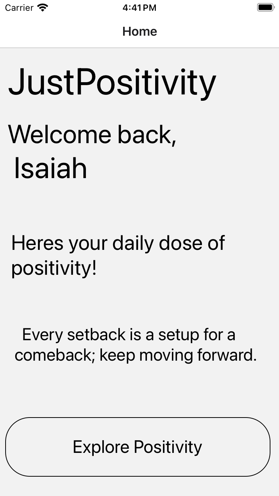
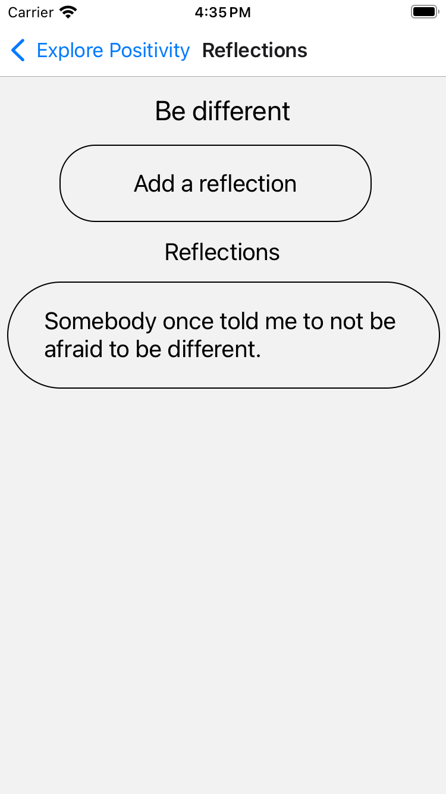
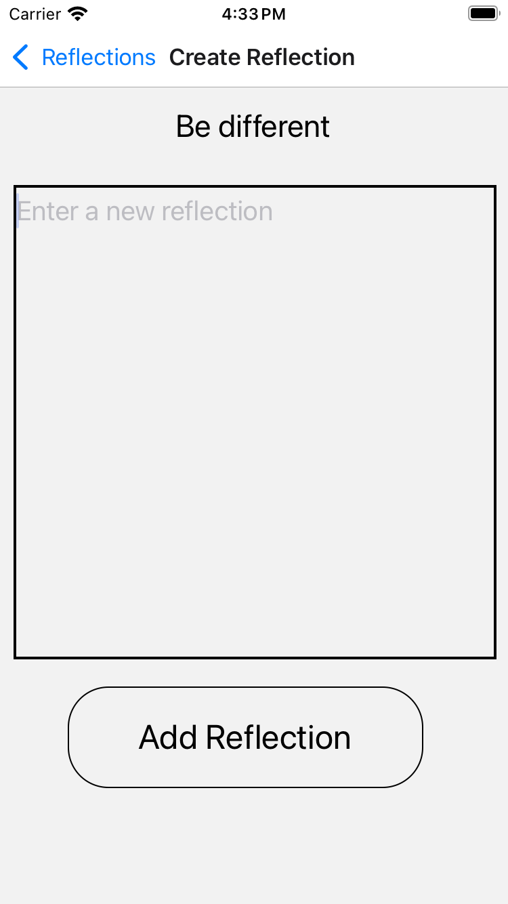
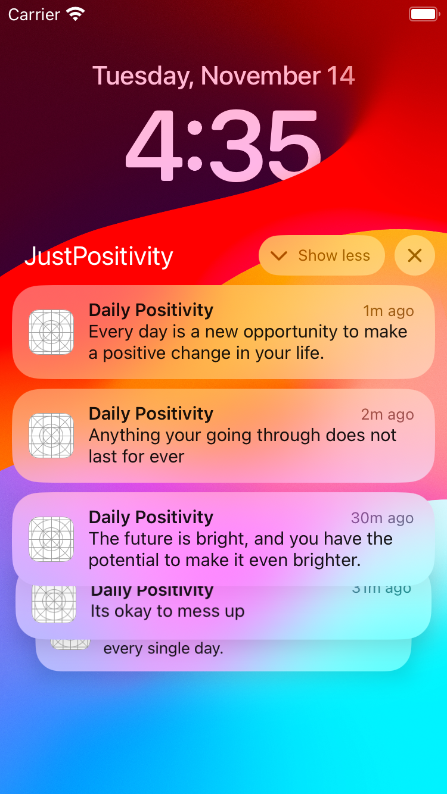
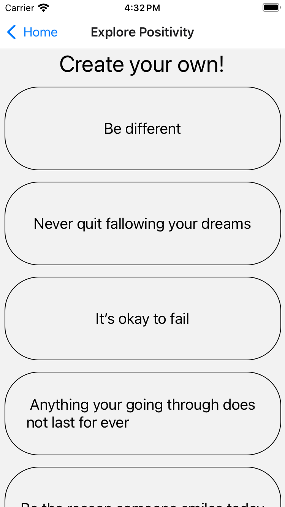

# JustPositivity

## Overview

The JustPositivity app is a platform designed to promote positivity by allowing users to create and share positive entries. Whether it's a moment of gratitude, a personal achievement, or a source of inspiration, JustPositivity is a space to celebrate and share positivity.

## Features

- Daily Positivity: Receive a daily dose of positivity to brighten your day.
- Create Positive Entries: Empower your day by crafting your own positive entries
- Reflect on Positive Entries: Dive deeper into your positive entries by adding reflections and insights.
- Explore Positivity: Scroll through a feed of positive entries from other users for inspiration and connection.
- User-friendly Interface: The app provides a simple and intuitive user interface for a seamless experience.

{width=50%}

